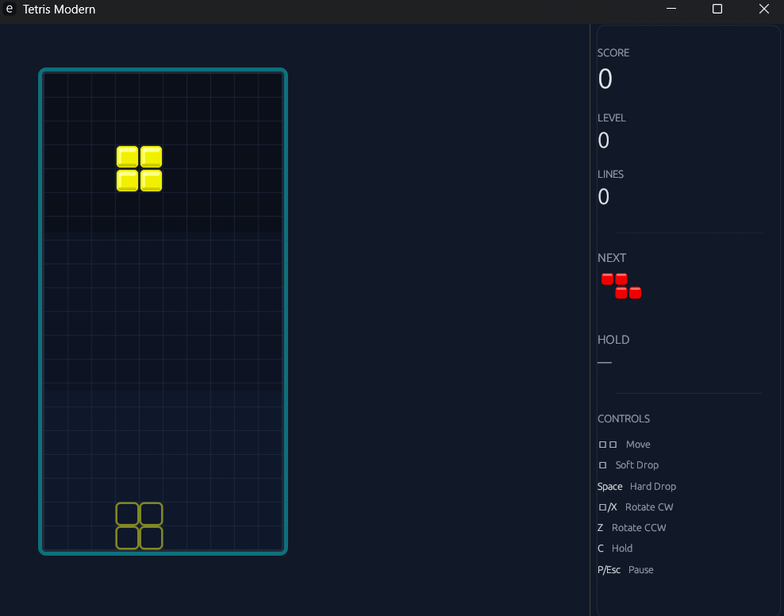

# Tetris Modern em Rust

Um jogo **Tetris completo** implementado em **Rust** com interface gráfica moderna usando **egui/eframe**.  
Sem imagens externas, sem áudio — visual gerado inteiramente por código!



## 🧩 Recursos

- Interface gráfica moderna com tema escuro/neon
- Ghost piece (prévia de onde a peça cairá)
- Hold piece (guardar peça para usar depois)
- Wall kick (rotação inteligente perto das paredes)
- Lock delay (tempo para ajustar antes de travar)
- 7-bag randomizer (distribuição justa de peças)
- Sistema de pontuação e níveis
- Menu, pausa e game over com overlay

## 🚀 Executar

```bash
cargo run
```

## 🕹️ Controles

| Tecla       | Ação                    |
| ----------- | ----------------------- |
| ←/→         | Mover esquerda/direita  |
| ↓           | Soft drop (acelerar)    |
| Space       | Hard drop (queda direta)|
| ↑ / X       | Rotacionar horário      |
| Z           | Rotacionar anti-horário |
| C           | Hold (guardar peça)     |
| P / Esc     | Pausar                  |
| R           | Reiniciar (game over)   |
| Q           | Voltar ao menu          |

## 🎨 Paleta de Cores

- Background: `#0B0F1A`
- Painéis: `#111827`
- Bordas: `#1F2937`
- Texto: `#E5E7EB` / `#9CA3AF`
- Blocos: Cyan, Yellow, Purple, Orange, Blue, Green, Red

## 📁 Estrutura do Projeto

```
src/
├── main.rs          # Inicialização do app
├── app/             # Estado do jogo, configurações
├── core/            # Lógica: board, peças, regras, RNG
├── render/          # Tema, desenho de blocos e painéis
└── time/            # Controle de tempo e gravidade
```
# tetris_rust
